# 💣 Exploding Kittens - Online Multiplayer Game

A real-time, multiplayer implementation of the popular card game Exploding Kittens, built with Next.js, WebSockets, and React.

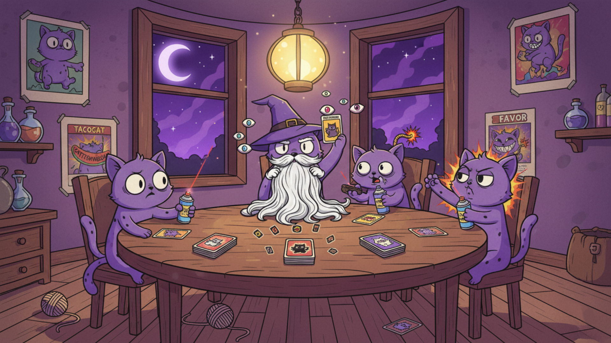

## 🎮 Overview

Exploding Kittens is a strategic card game where players take turns drawing cards until someone draws an Exploding Kitten. When that happens, they explode and are eliminated from the game... unless they have a Defuse card to save themselves! The last player standing wins.

## 🃏 Game Cards

### 💣 Exploding Kitten
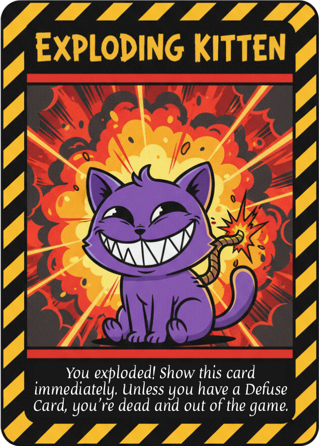

**Effect:** You explode and are out of the game unless you play a Defuse card.

**Details:**
- If you draw this card, you must immediately play a Defuse card or you're eliminated
- After defusing, you must secretly put the Exploding Kitten back into the draw pile anywhere you'd like
- The number of Exploding Kittens in the deck equals the number of players minus one

---

### 🛡️ Defuse
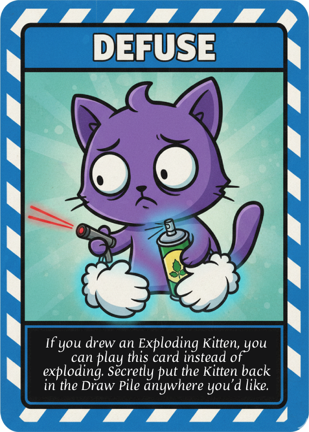

**Effect:** Save yourself from an Exploding Kitten.

**Details:**
- Each player starts with one Defuse card
- When you defuse an Exploding Kitten, you get to secretly place it back in the draw pile anywhere you choose
- This is your lifeline - use it wisely!
- A few extra Defuse cards are shuffled into the deck

---

### 🚫 Nope
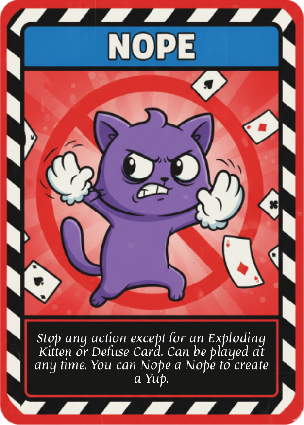

**Effect:** Stop any action card from being played (except Exploding Kitten and Defuse).

**Details:**
- Can be played at any time, even on another player's turn
- Can be played on any action card before it takes effect
- Nope cards can be played on other Nope cards, creating a Nope chain
- The action is cancelled if there's an odd number of Nopes played
- A 3-second window is given for players to play Nope cards

---

### ⚔️ Attack
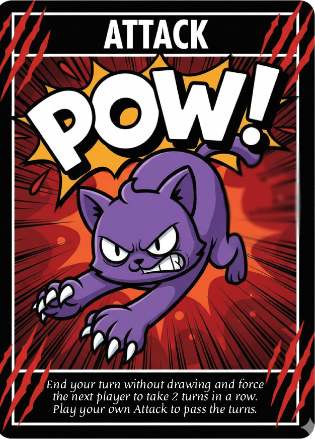

**Effect:** End your turn without drawing a card and force the next player to take TWO turns.

**Details:**
- The attacked player must take two turns in a row
- They draw two cards (unless they play special cards to avoid it)
- Attack cards can stack - if you're attacked, you can play an Attack card to pass the turns to the next player
- You cannot play this card during your drawing phase

---

### ⏭️ Skip
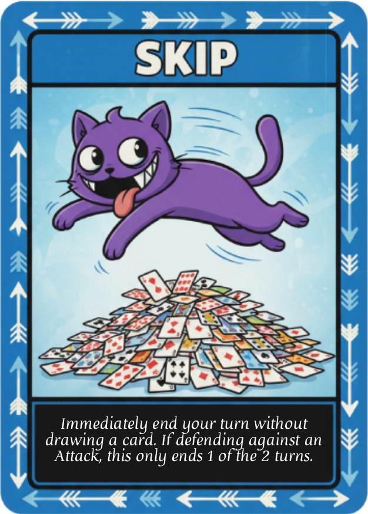

**Effect:** End your turn without drawing a card.

**Details:**
- Use this to avoid drawing from the deck
- Especially useful when you suspect an Exploding Kitten is on top
- If you're under attack (multiple turns), this only ends ONE turn
- Can be Noped

---

### 🎁 Favor
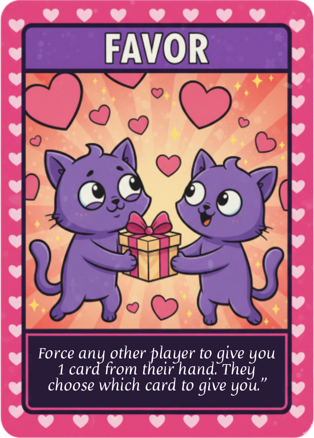

**Effect:** Force another player to give you a card of their choice.

**Details:**
- Target any other player who has cards
- They must choose which card to give you (you don't get to pick)
- Great for getting cards you need
- Can be Noped before it takes effect

---

### 🔀 Shuffle
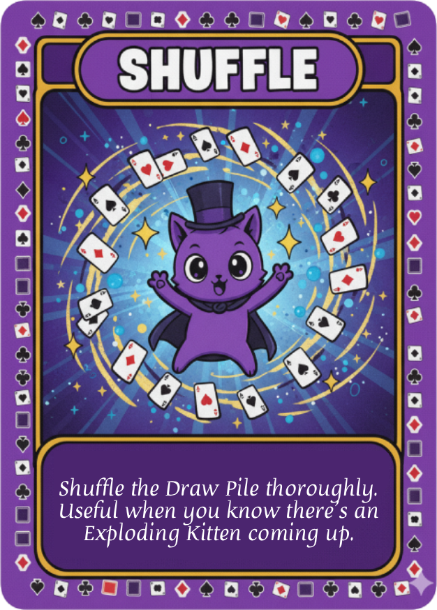

**Effect:** Shuffle the draw pile.

**Details:**
- Randomly rearranges all cards in the draw pile
- Use this to mess up other players' plans
- Especially useful after someone plays "See the Future"
- Can be Noped

---

### 🔮 See the Future
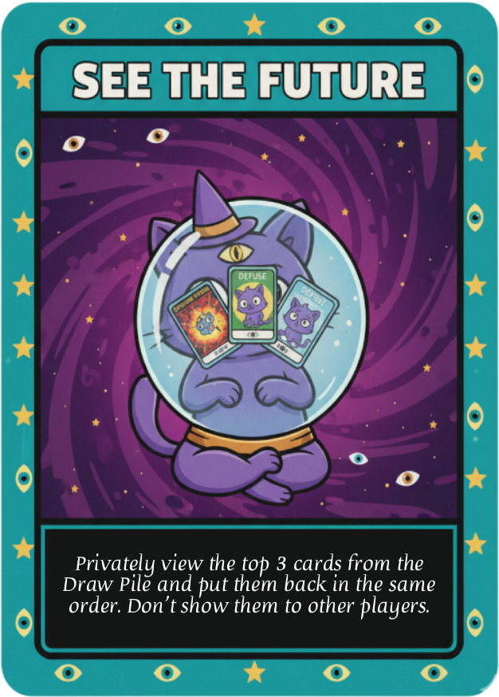

**Effect:** Peek at the top 3 cards of the draw pile.

**Details:**
- You privately view the next 3 cards that will be drawn
- Use this information to plan your strategy
- Combine with Shuffle or Alter the Future for maximum effect
- Other players won't know what you saw
- Can be Noped

---

### 🔄 Alter the Future
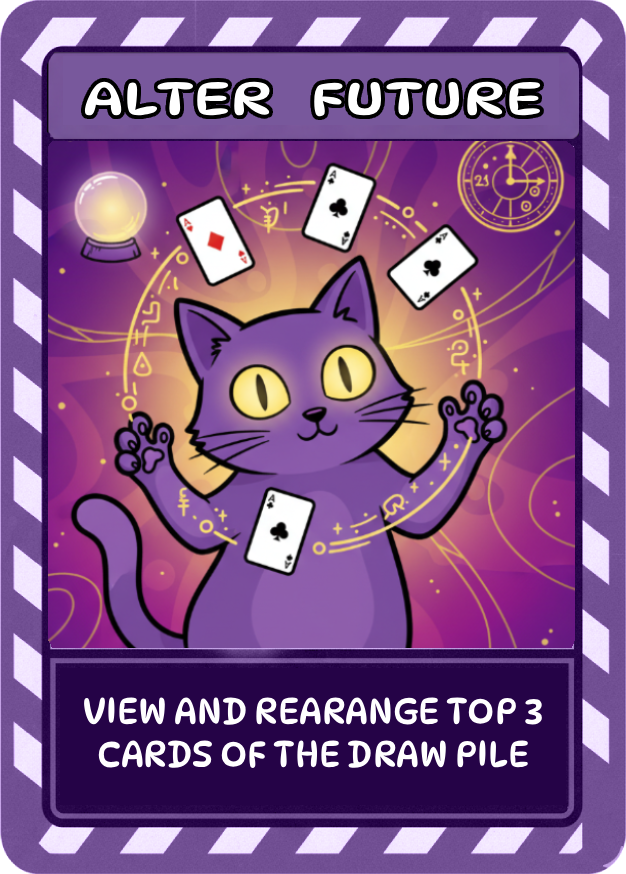

**Effect:** View and rearrange the top 3 cards of the draw pile.

**Details:**
- Similar to See the Future, but you can rearrange the cards
- Place an Exploding Kitten on top to target the next player
- Or move it to the bottom to protect yourself
- Strategic card for advanced players
- Can be Noped

---

### 📍 Bury
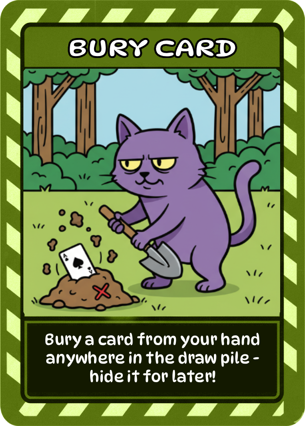

**Effect:** Bury a card from your hand anywhere in the draw pile.

**Details:**
- Choose any card from your hand
- Place it anywhere in the draw pile (top, middle, or bottom)
- Great for getting rid of unwanted cards
- Can strategically place useful cards for later
- Can be Noped

---

### 🔄 Reverse
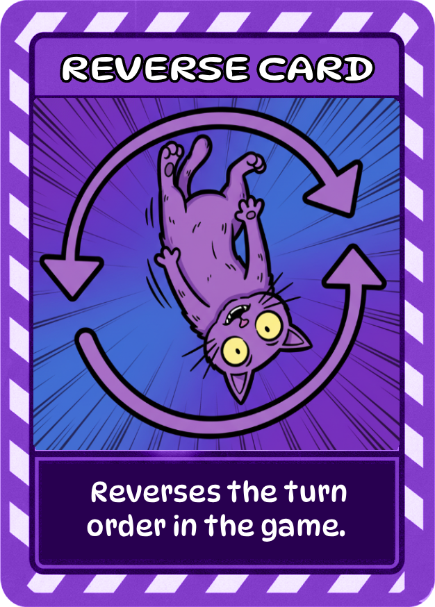

**Effect:** Reverse the turn order direction.

**Details:**
- Changes turn order from clockwise to counterclockwise (or vice versa)
- Useful in strategic situations with 3+ players
- Can help you avoid an attack chain
- Can be Noped

---

### ⬇️ Draw from Bottom
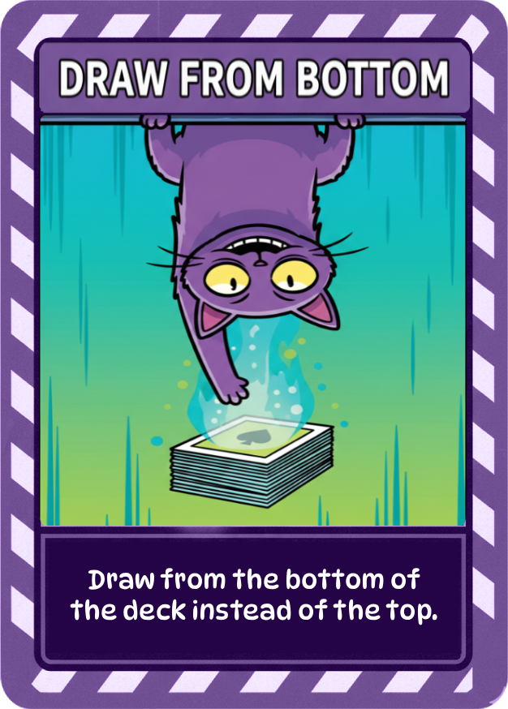

**Effect:** Draw a card from the bottom of the draw pile instead of the top.

**Details:**
- Ends your turn like a normal draw
- Useful when you suspect an Exploding Kitten is on top
- The card still counts as your draw for the turn
- Can still be an Exploding Kitten if one is on the bottom
- Can be Noped

---

### 🐱 Cat Cards (Combo Cards)
<table>
<tr>
<td align="center">
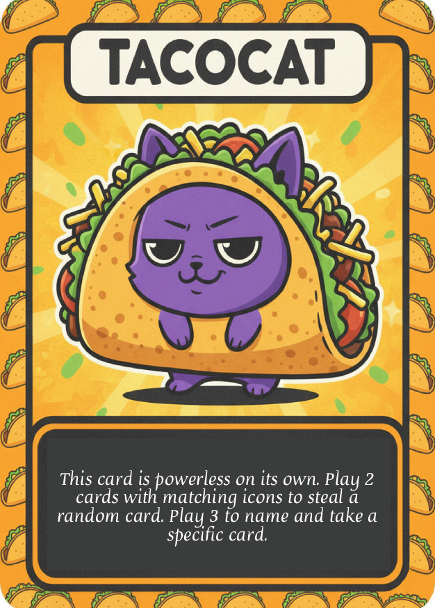<br>
<b>Taco Cat</b>
</td>
<td align="center">
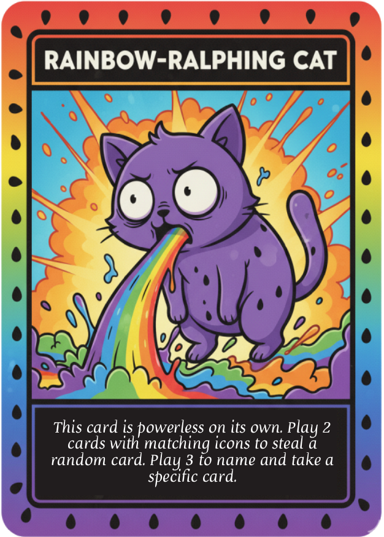<br>
<b>Rainbow Cat</b>
</td>
<td align="center">
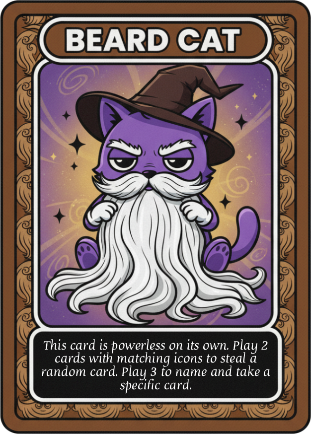<br>
<b>Beard Cat</b>
</td>
</tr>
<tr>
<td align="center">
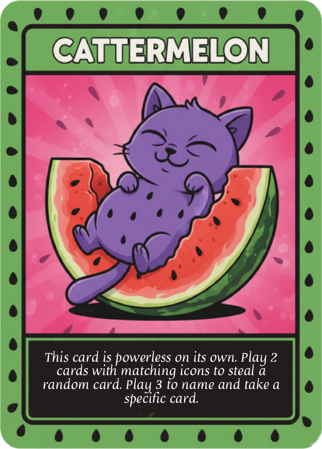<br>
<b>Melon Cat</b>
</td>
<td align="center">
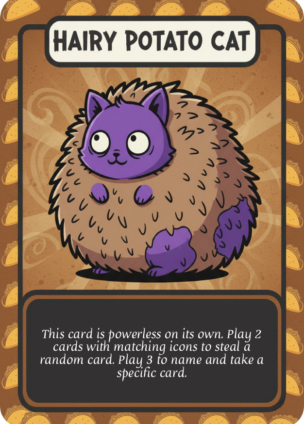<br>
<b>Potato Cat</b>
</td>
<td></td>
</tr>
</table>

**Effect:** Play matching pairs or triples to steal cards from other players.

**Details:**
- **2 Matching Cats:** Steal a random card from any player
- **3 Matching Cats:** Steal a specific card type from any player (they must have it)
- Cat cards have no individual effect
- All 5 cat types work the same way - only matching matters
- Can be Noped

---

## 🎯 How to Play

### Setup
1. Join or create a game room (2-5 players)
2. Each player receives:
   - 5 random cards
   - 1 Defuse card
3. Remaining Defuse cards and Exploding Kittens are shuffled into the deck
4. One fewer Exploding Kitten than the number of players is added

### Turn Structure

**On Your Turn:**
1. **Play Phase:** Play as many action cards as you want (optional)
2. **Draw Phase:** Draw a card from the top of the deck (required)
3. If you survive, your turn ends

**Special Cases:**
- If you play an **Attack** or **Skip** card, you don't draw
- If you're under attack, you must take multiple turns
- If you draw an **Exploding Kitten**, you must play a Defuse or lose

### Nope Mechanics
- When any action card is played, a 3-second Nope window opens
- Any player can play a Nope card to cancel the action
- Another Nope cancels the first Nope (chain continues)
- Odd number of Nopes = action cancelled
- Even number of Nopes = action succeeds

## 🏆 Winning

The last player remaining alive wins the game! All other players are eliminated by Exploding Kittens.

## 📋 Game Rules

### Basic Rules
1. **You must draw** a card on your turn unless you play a card that says otherwise
2. **You can play as many cards** as you want before drawing
3. **Nope cards** can be played at any time during another player's turn
4. **You're eliminated** if you explode without a Defuse card
5. **Last player standing wins**

### Card Counts
- **Exploding Kittens:** Number of players - 1
- **Defuse:** 6 total (1 per player + extras in deck)
- **Nope:** 5
- **See the Future:** 5
- **Attack, Skip, Favor, Shuffle:** 4 each
- **Cat Cards (each type):** 4 each
- **Reverse, Draw from Bottom, Alter the Future, Bury:** 4 each

### Strategy Tips
- 💡 Use **See the Future** to know what's coming
- 💡 Save your **Skip** cards for dangerous moments
- 💡 Play **Attack** to force others to draw dangerous cards
- 💡 **Shuffle** after someone uses See the Future to mess with their plans
- 💡 Save your **Defuse** for Exploding Kittens (obviously!)
- 💡 Collect **Cat pairs/triples** to steal powerful cards
- 💡 Use **Bury** to set up future draws or get rid of bad cards
- 💡 **Reverse** can help you avoid an incoming Attack

## 🚀 Getting Started

### Prerequisites
- Node.js 18+ 
- npm or pnpm

### Installation

```bash
# Clone the repository
git clone <repository-url>

# Install dependencies
npm install
# or
pnpm install

# Run the development server
npm run dev
# or
pnpm dev
```

Open [http://localhost:3000](http://localhost:3000) to start playing!

### Building for Production

```bash
# Build the app
npm run build

# Start production server
npm start
```

## 🛠️ Technology Stack

- **Framework:** Next.js 14 (App Router)
- **Language:** TypeScript
- **Styling:** Tailwind CSS
- **Real-time:** WebSocket (WS)
- **State Management:** React Hooks
- **UI Components:** Custom components with Radix UI primitives

## 📁 Project Structure

```
├── app/                    # Next.js app router pages
│   ├── api/               # API routes
│   ├── game/[id]/         # Game room page
│   ├── lobby/             # Lobby page
│   └── room/[id]/         # Room setup page
├── components/            # React components
│   ├── ui/               # Reusable UI components
│   ├── game-card.tsx     # Card display component
│   ├── player-hand.tsx   # Player hand component
│   └── ...               # Other game components
├── lib/                   # Game logic and utilities
│   ├── game-logic.ts     # Core game mechanics
│   ├── game-engine.ts    # Game state management
│   ├── types.ts          # TypeScript types
│   └── use-websocket.ts  # WebSocket hook
├── public/cat/           # Card images and assets
└── server.ts             # WebSocket server
```

## 🎮 Features

- ✅ Real-time multiplayer with WebSockets
- ✅ Beautiful card artwork and animations
- ✅ Nope chain mechanics with 3-second window
- ✅ All card effects fully implemented
- ✅ Strategic card placement (Exploding Kitten, Bury)
- ✅ Turn direction reversal
- ✅ Cat card combos (pairs and triples)
- ✅ Player elimination and win detection
- ✅ Responsive design for all devices
- ✅ Smooth animations and visual effects

## 🎨 Card Effects & Animations

- **Hover Effects:** Cards lift and scale when hovered
- **Selection Glow:** Selected cards have a yellow ring
- **Special Card Wiggle:** Exploding Kitten, Defuse, and Nope cards wiggle
- **Smooth Transitions:** All actions are animated smoothly
- **Explosion Animation:** Special effect when a player explodes

## 🐛 Known Issues & Future Enhancements

### Potential Improvements
- [ ] Add sound effects and music
- [ ] Add chat functionality
- [ ] Add game statistics and history
- [ ] Add different game modes (expansions)
- [ ] Add AI opponents for solo play
- [ ] Add replay system
- [ ] Mobile app version

## 📝 License

This is a fan-made implementation for educational purposes. Exploding Kittens is a trademark of Exploding Kittens Inc.

## 🙏 Acknowledgments

- Exploding Kittens game designed by Elan Lee, Matthew Inman (The Oatmeal), and Shane Small
- Card artwork inspired by the original game
- Built with ❤️ using modern web technologies

---

## 🎲 Ready to Play?

Start the game and see who will be the last kitten standing! 

**Remember:** Don't explode! 💣🐱
